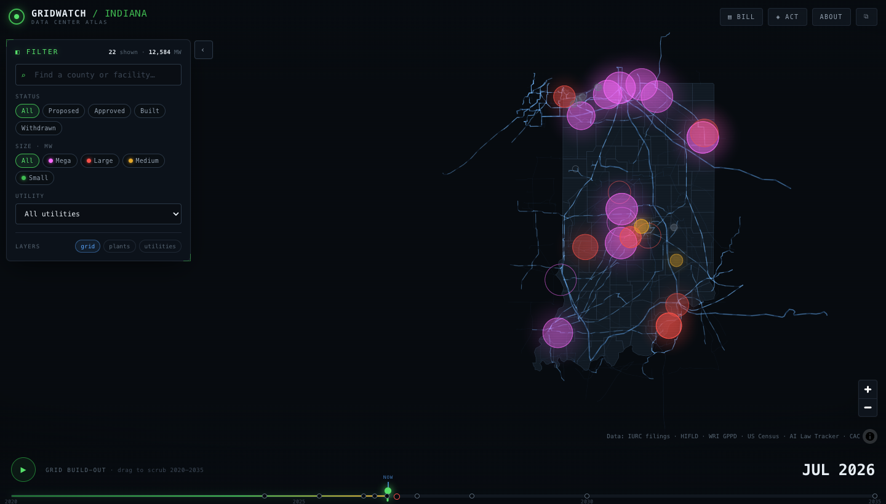

# GridWatch Indiana

**An interactive atlas that maps every proposed and existing data center in Indiana against the state's power grid — megawatts, water use, IURC dockets, and projected bill impact — all from public records.**



Indiana is in the middle of a live fight over data-center energy. As of mid-2026 there are **46 tracked data-center projects** across the state, and the active ones already add up to roughly **12,600 MW — about 36% of Indiana's peak demand** — on a grid that's still **61% coal**. Meanwhile residential electric bills jumped ~17% this year.

All of that information exists. It's just scattered across hundreds of IURC docket filings, utility integrated resource plans, county planning documents, and news stories. Nobody had assembled it into one navigable picture. So a Hamilton County resident couldn't easily answer a simple question: *what's being built near me, how much power will it draw, and will it raise my bill?*

GridWatch answers exactly that.

---

## What it does

- **Maps the whole fleet.** Every data center renders as a glowing node sized by megawatts and colored by load severity — green under 50 MW up to magenta for the hyperscalers that are off the scale Indiana's grid was built for. Existing power plants, ≥138 kV transmission lines, and utility service territories layer underneath.
- **Filters to what matters.** Filter the map live by status (proposed, approved, built, withdrawn), by size tier (small up to off-the-scale hyperscale), and by serving utility. The count updates as you go. Search any county or facility to fly straight to it.
- **Scrubs through time.** A 2020 → 2035 timeline animates the build-out. Drag it and watch the grid fill as nodes appear and grow toward their projected energization.
- **Shows the receipts.** Click any node for a full dossier: capacity, water use, acreage, investment, developer, serving utility, IURC cause number, and **every figure linked to its public source**. When a developer redacts a number, the card flags it `◈ DEVELOPER-REDACTED` instead of guessing.
- **Projects your bill.** A transparent calculator combines each utility's IURC-approved rate change with an illustrative split of filed data-center infrastructure costs. Clearly labeled as a projection, with the math shown.
- **Points to the process.** A nonpartisan action layer lists how to file an IURC comment, the active dockets, and where the public hearings are. It shows the process, not a position.

No accounts. No tracking. No API keys. It loads straight into the console from a single link.

## Live data, honestly sourced

Every number traces to a public document. The data lives as version-controlled JSON/GeoJSON in [`/public/data`](public/data) so anyone can audit or reuse it.

| Layer | Source |
|-------|--------|
| Data-center facilities | IURC filings, utility filings, county records, [AI Law Tracker](https://ailawtracker.org/data-centers), and news reporting — **cited per record** |
| Power plants | [WRI Global Power Plant Database](https://datasets.wri.org/dataset/globalpowerplantdatabase) v1.3.0 |
| Transmission (≥138 kV) | [HIFLD](https://hifld-geoplatform.hub.arcgis.com/) Electric Power Transmission Lines |
| Utility territories | HIFLD Electric Retail Service Territories |
| County boundaries | US Census cartographic boundaries |
| Ratepayer / docket context | [IURC docket portal](https://iurc.portal.in.gov/), [Citizens Action Coalition](https://www.citact.org/ai-data-centers) |

The full sourcing method — including what's verified versus estimated versus redacted — is in **[METHODOLOGY.md](METHODOLOGY.md)**.

## Tech

Deliberately boring and forkable:

- **[MapLibre GL JS](https://maplibre.org/) v5** with a keyless dark vector basemap ([CARTO](https://carto.com/basemaps) dark-matter) — streets, water, and labels, masked to the Indiana border so nothing renders outside the state. No Mapbox/Google key. The facility, grid, and territory overlays are self-hosted GeoJSON.
- **[Vite](https://vitejs.dev/)** + **TypeScript**, hand-written CSS design tokens, **[D3](https://d3js.org/)** for scales.
- **[Python](pipeline/)** pipeline fetches and simplifies the geodata into static files.
- Ships as static files. Host it free on Vercel, Netlify, or GitHub Pages, forever.

## Quickstart

```bash
npm install
npm run dev        # local dev server at http://localhost:5173
npm run build      # production build → dist/
npm run preview    # serve the production build
npm run test:all   # typecheck + TS tests + pipeline tests
```

Refresh the underlying data any time:

```bash
python3 pipeline/fetch_geo.py       # pull counties, plants, transmission, territories
python3 pipeline/build_dataset.py   # recompute statewide roll-ups → meta.json
python3 pipeline/validate.py --links # schema + source-link checks
```

## Deploy

It's a static site, so deployment is one step:

- **Vercel** — import the repo; `vercel.json` sets build + output. Or `npx vercel --prod`.
- **Netlify** — `netlify.toml` is included; drag-and-drop `dist/` also works.
- **GitHub Pages** — push to `main`; the included [workflow](.github/workflows/deploy.yml) builds and publishes automatically.

Because `vite.config.ts` uses a relative base, the same build runs from any host or sub-path.

## Fork it for anywhere in the world

Indiana is the reference implementation; the engine underneath is
region-agnostic. One command maps any region on Earth — outline, subdivisions,
power plants, transmission, substations — and re-tunes the whole atlas to it:

```bash
npm run region -- --region "Ohio, United States" --activate
npm run dev
```

Units, currency, terminology ("county" vs "Kreis"), and the color scale adapt
automatically; roads and cities come from the global basemap.

Units, currency, terminology, and the color scale adapt automatically. Roads,
cities, and water come from the global basemap, so they already work everywhere.

### Then bring your data — paste this into Claude

The map is automatic; the facilities are yours to research. Copy the prompt
below into Claude (or any LLM with web search), replacing `{{REGION}}`. It's
written so the model can't quietly invent figures — unknowns stay `null`, and
every number needs a citation.

<details>
<summary><b>Click to expand the setup prompt</b></summary>

```text
I'm building a GridWatch atlas for {{REGION}} and need you to research the data
centers there. Return a single JSON object, nothing else.

THE RULE THAT GOVERNS EVERYTHING: if you cannot cite it, do not state it.
- Every facility needs at least one real, working source URL.
- Any figure you can't find in a document is null. Never 0, never a "typical"
  value, never an average of conflicting reports.
- If you're not confident a project exists, leave it out and list it under
  "uncertain" instead.
Ten sourced facilities beat fifty guesses.

WHERE TO LOOK, in order of authority: utility regulator filings (rate cases,
interconnection requests, special contracts); local government records (rezoning
petitions, planning-commission minutes, tax abatements); utility resource plans;
company announcements; local and trade press; industry trackers (treat these as
leads, not facts — set mw_estimated true).

FORMAT:
{
  "region": "{{REGION}}",
  "facilities": [{
    "id": "operator-town",
    "name": "Full facility name",
    "developer": "Company, or Undisclosed",
    "city": "Town",
    "county": "Subdivision WITHOUT the word County/Parish/Kreis",
    "lat": 40.0481, "lng": -86.4691,
    "geo_precision": "parcel | site | city | county",
    "status": "proposed | approved | construction | operational | rumored | withdrawn",
    "mw_phase1": null, "mw_full": 600, "mw_estimated": false,
    "acres": null, "investment_usd": null,
    "water_mgd": null, "water_status": "known | redacted | unknown",
    "utility": "Serving electric utility",
    "iurc_docket": null, "docket_url": null,
    "announced_year": 2025, "online_year": null, "tax_note": null,
    "sources": [{"label": "Publication — headline", "url": "https://..."}],
    "notes": "Plain-language context. Say explicitly what is unconfirmed.",
    "last_verified": "YYYY-MM-DD"
  }],
  "uncertain": [{"name": "...", "why": "what you found and why it fell short"}],
  "coverage_note": "What you searched and what you likely missed."
}

FIELD RULES:
- status: "rumored" = reported but unconfirmed, or no named operator.
  "withdrawn" = cancelled, rejected, or denied at rezoning.
- geo_precision: be honest. "parcel" only for a surveyed parcel.
- water_status "redacted" specifically means a developer withheld it in a public
  filing — that's a meaningful fact, distinct from "unknown".
- mw_estimated: true when capacity comes from reporting rather than a filing.

BEFORE YOU ANSWER, verify: every facility has a real source URL; no number
appears that you can't point to; every unknown is null; county names have no
suffix; no duplicate ids; mw_phase1 <= mw_full; every status is one of the six.

After the JSON, tell me in prose: what you searched and likely missed, where
sources conflicted, and the 2-3 records most worth a human verifying.
```

</details>

Save the JSON, then:

```bash
npm run validate -- my-facilities.json   # enforces the sourcing rule
```

The validator checks structure — every facility sourced, no duplicate ids,
coordinates in range, county matching its own coordinates. **It cannot check
whether a number is true**, so open a few source links yourself before you
publish.

[`prompts/`](prompts/) has three more: bill models, civic process, and an
adversarial audit pass to run before going live. Using Claude Code?
`.claude/skills/gridwatch-region/` runs the whole flow.

See **[FORKING.md](FORKING.md)** for the full guide.

## Contributing

Corrections and new filings are welcome — they're the most valuable contribution
here. A data center moved, a docket got decided, a redacted figure became
public? Open a PR against `public/data/facilities.json` with a source link, or
file an issue.

One rule governs everything: **if you can't cite it, don't add it.** Read
**[CONTRIBUTING.md](CONTRIBUTING.md)** before your first PR.

Data decays, so staleness is tracked rather than ignored: `npm run freshness`
reports the dataset's age, and the app shows visitors a banner automatically
once it's six months old.

## Project structure

```
public/data/     static JSON + GeoJSON — the whole dataset, auditable
pipeline/        reproducible Python fetch + build + validate scripts
src/lib/         map engine, console, timeline, calculator, modals
src/styles/      design tokens + component CSS
docs/            screenshots + notes
```

## A note on scope

GridWatch is civic infrastructure, not an awareness campaign. It's meant to be *used and cited* — by residents checking their county, reporters chasing a filing, and officials in a hearing. It's nonpartisan and it is **not legal or financial advice**.

## License

Code: [MIT](LICENSE). Compiled data: CC BY 4.0 (source documents remain their publishers'). Attribution appreciated.

*Built with public data and a lot of docket-reading. Dataset last updated 2026-07-16.*
